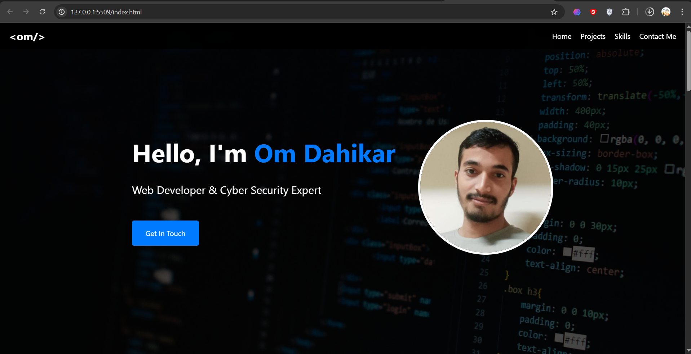
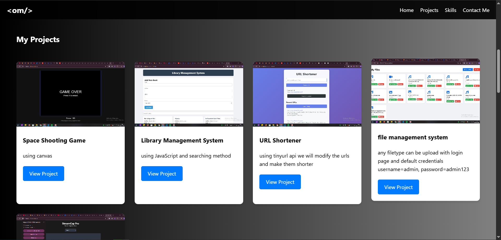
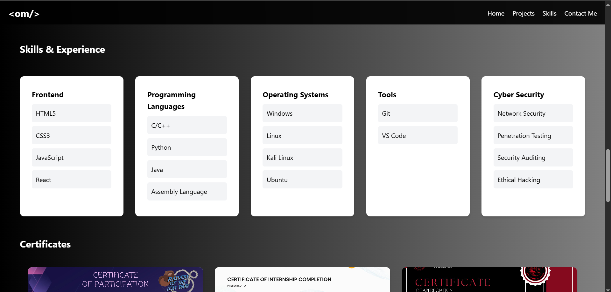
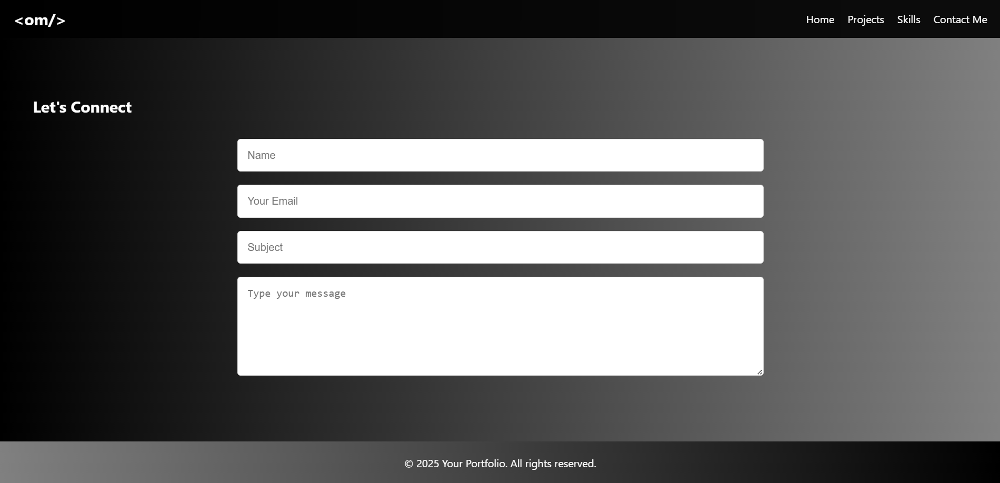

# My Portfolio

Welcome to my portfolio! This repository showcases my projects, skills, and experience as a **Web Developer**. It is built using only **HTML, CSS, and JavaScript**.


## 📸 Screenshots
Here are some screenshots of my portfolio:






## 🚀 Features
- Fully responsive design for all devices.
- Smooth animations and transitions.
- Interactive UI elements.
- Optimized for fast loading speed.
- Clean and modern layout.
- Easy navigation.

## 🛠️ Technologies Used
This portfolio is built using:
- **HTML** - Structure of the webpage.
- **CSS** - Styling and layout.
- **JavaScript** - Adding interactivity and animations.

## 📂 Project Structure
```
root/
├── images/
│   ├── background.jpg
│   ├── cert1.jpg
│   ├── cert2.jpg
│   ├── cert3.jpg
│   ├── profile.png
│   ├── project1.png
│   ├── project2.png
│   ├── project3.png
│   ├── project4.png
│   ├── project5.png
│   ├── s1.png
│   ├── s2.png
│   ├── s3.png
│   ├── s4.png
├── projects/
│   ├── project1.html
│   ├── project2.html
│   ├── project3.html
│   ├── project4.html
│   ├── project5.html
│   ├── project6.html
├── index.html
├── script.js
├── styles.css
├── README.md
└── LICENSE
```

## 📥 Installation
To run this project locally, follow these steps:

```sh
# Clone the repository
git clone https://github.com/omdahikar/my-portfolio.git

# Navigate to the project directory
cd my-portfolio

# Open index.html in your browser
start index.html (Windows) or open index.html (Mac)
```

## 📬 Contact
Feel free to reach out if you have any questions or suggestions!

- 📧 Email: [omdahikar36@gmail.com](mailto:omdahikar36@gmail.com)
- 🔗 LinkedIn: [my linked in](https://www.linkedin.com/in/om-dahikar-1044aa289/)

---
⭐ Don't forget to **star** the repository if you find it useful!

